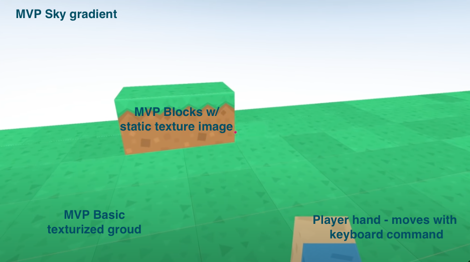
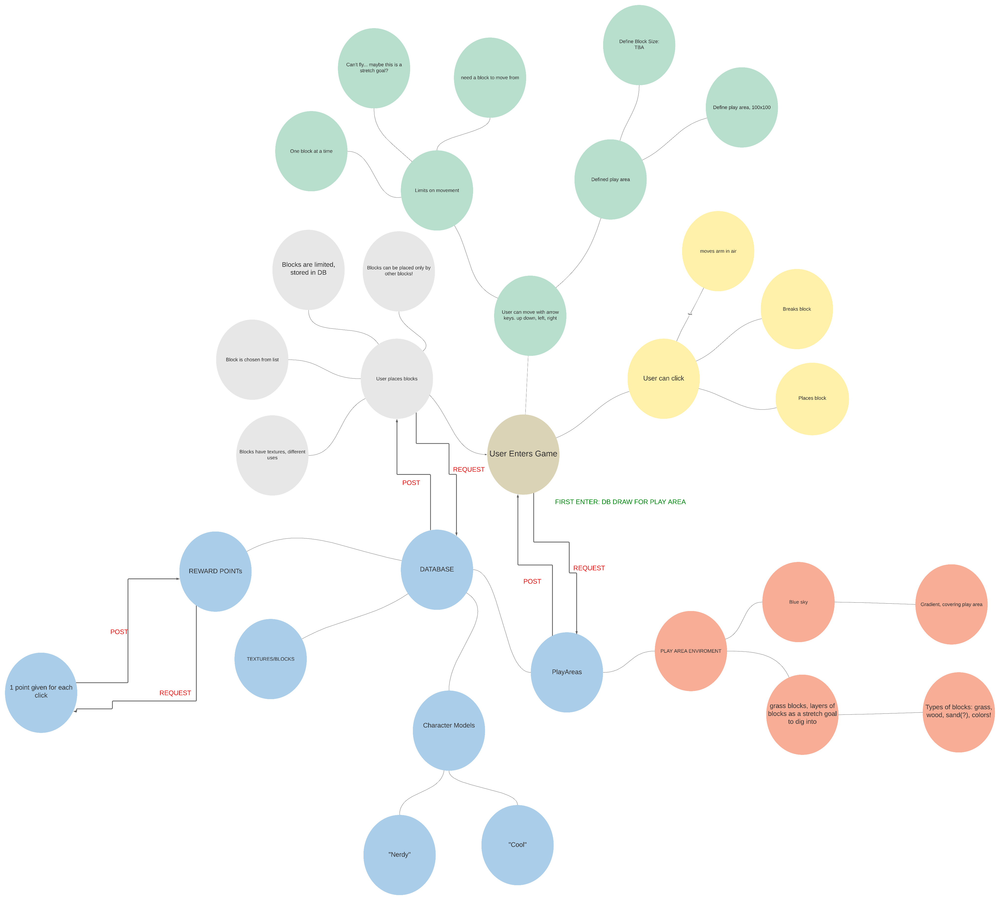

# Team Creep

Group Members: Audrena Vacirca, Nebiyu Kifle, Sian Culligan, Grace Choi

### User Stories 

| No | User Stories | 
|-----------|:------------:|
| 1   | As a user, I want a fun, interactive UI, so that I can kill some quarantine boredom   |
| 2   | As a user, I want to be able to build items to improve the overall aesthetic of my….land?   |
| 3   | As a user, I want to easily understand the scoring system, so that they can rack up as many points as possible   |
| 4   | As a dev, I want to create a persistant database with an arbitrary scoring system, so that users can store their high scores   |
| 5   | As a dev, I want the user to land in an empty landscape, so that they can start from scratch and build new things   |

### MVP Wireframe

### Requirements
The vision of this project is to create a landscape world that allows the user to login and create and destroy blocks. These blocks can be used to build a digital world. This game allows a user to expand their creativity and kill boredom. Our first goal is to let the user expand on their creativity. Our stretch goal is to have a Survival mode that challenges the user to survive in their constructed universe (build shelter, find food, and craft tools). 

See the rest of the Software Requirements, [here](SoftwareRequirements.md). 

### Domain Model
[Click here for a live link](https://lucid.app/lucidspark/invitations/accept/inv_4bfd9fa7-e295-4247-8b83-4c9a639f2799)

  

### Change Log
5/1: Project Prep Added  
5/3: File Structure Added  
5/4: Tutorial Files Started  
5/6: Base landscape  
5/7: Base movement and border walls
5/8: Django added. Sky & Floor movement limits, set textures, and mouse clicks  
5/10: Scoring and adding clocks in position  
5/11: Docker added and db connected  
5/12: Deployment  
5/13: New texture added and gameplay instructions added  

